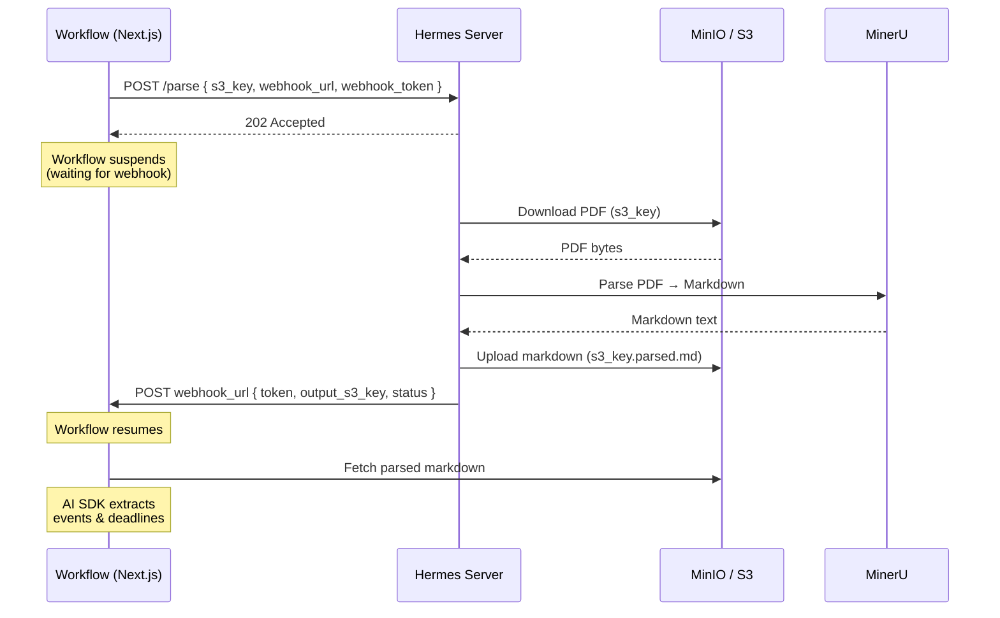
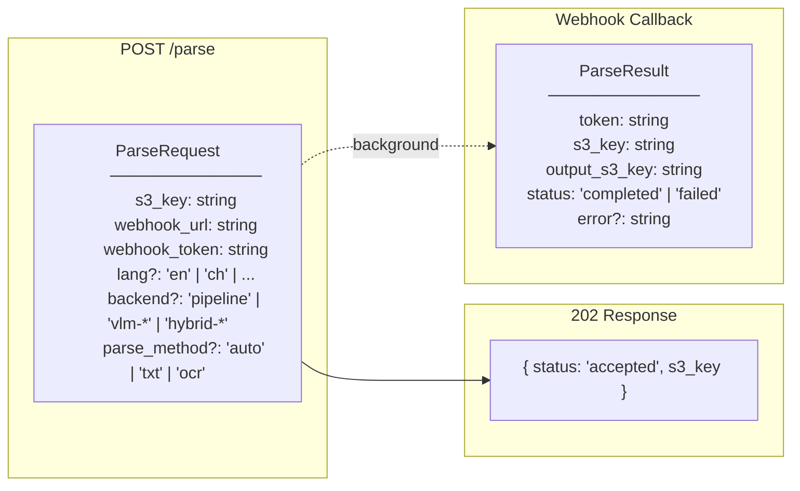
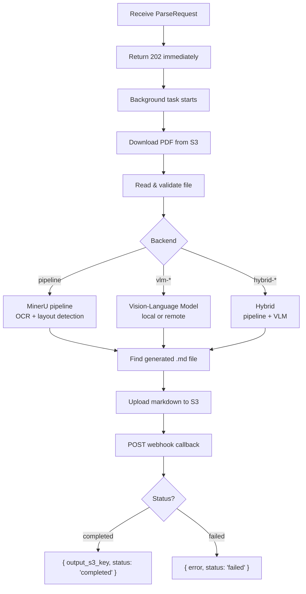

# Hermes

Document parsing service for DueDeck. Named after the Greek god of interpretation and messengers — Hermes reads documents and delivers structured results.

## Architecture

Hermes is split into two packages:

| Package | Location | Language | Role |
|---|---|---|---|
| `@repo/hermes` | `packages/hermes/` | TypeScript | Type-safe client (API contract) |
| `@repo/hermes-server` | `services/hermes/` | Python | FastAPI server (parsing backend) |

The client only knows the API contract. The server is an implementation detail — currently MinerU, but swappable for any backend that implements the same `POST /parse` contract.

## How It Works



## Request / Response



## Internal Processing



## Running Locally

```bash
# Start dependencies
docker compose up -d   # PostgreSQL + MinIO

# Start the server
bun run --filter @repo/hermes-server dev
# → http://127.0.0.1:8000
# → http://127.0.0.1:8000/docs (Swagger UI)
```

## Environment Variables

| Variable | Default | Description |
|---|---|---|
| `S3_ENDPOINT` | `http://localhost:9000` | S3/MinIO endpoint |
| `S3_ACCESS_KEY` | `duedeck` | S3 access key |
| `S3_SECRET_KEY` | `duedeck123` | S3 secret key |
| `S3_BUCKET` | `uploads` | Bucket for PDFs and parsed output |
| `S3_REGION` | `us-east-1` | S3 region |

## Client Usage (TypeScript)

```typescript
import { parseParsePost } from "@repo/hermes";

// Trigger a parse job
const { data } = await parseParsePost({
  body: {
    s3_key: "abc123.pdf",
    webhook_url: "https://myapp.com/api/webhook/parse",
    webhook_token: "wh_randomtoken",
  },
});
// data = { status: "accepted", s3_key: "abc123.pdf" }
```

Configure the server URL via `HERMES_API_URL` env var (defaults to `http://127.0.0.1:8000`).

## Tests

```bash
cd services/hermes

# Fast tests (mocked parsing, real MinIO)
uv run pytest tests/ -k "not e2e"

# Full end-to-end (real PDF parsing — needs models downloaded)
uv run pytest tests/ -k "e2e" -s
```

## Regenerating the Client

When the server API changes:

```bash
# Start the server
bun run --filter @repo/hermes-server dev

# Fetch the new schema and regenerate
curl http://127.0.0.1:8000/openapi.json -o packages/hermes/configs/hermes.openapi.json
bun run codegen
```
